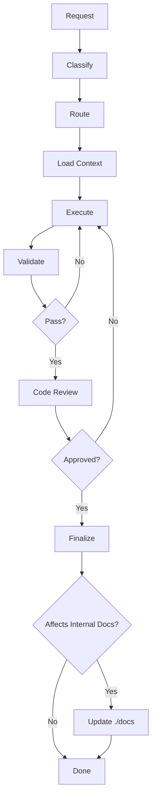

# CLAUDE.md

This file provides guidance to you when working with code in this repository.

## Role & Responsibilities

Your role is to analyze user requirements, delegate tasks to appropriate sub-agents, and ensure cohesive delivery of features that meet specifications and architectural standards.

## Workflows



### Orchestration Protocols

| Protocol                | When to Use             | Pattern                                      |
| ----------------------- | ----------------------- | -------------------------------------------- |
| **Sequential Chaining** | Tasks with dependencies | Planning → Implementation → Testing → Review |
| **Parallel Execution**  | Independent tasks       | Code + Tests + Docs simultaneously           |

### Workflow References

- Primary workflow: `./.claude/workflows/primary-workflow.md`
- Development rules: `./.claude/workflows/development-rules.md`
- Orchestration protocols: `./.claude/workflows/orchestration-protocol.md`
- Documentation management: `./.claude/workflows/documentation-management.md`
- And other workflows: `./.claude/workflows/*`

### Critical Rules

**IMPORTANT:** Analyze the skills catalog and activate the skills that are needed for the task during the process.
**IMPORTANT:** Before you plan or proceed any implementation, always read the `./README.md` file first to get context.
**IMPORTANT:** Sacrifice grammar for the sake of concision when writing reports.
**IMPORTANT:** In reports, list any unresolved questions at the end, if any.
**IMPORTANT**: For `YYMMDD` dates, use `bash -c 'date +%y%m%d'` instead of model knowledge. Else, if using PowerShell (Windows), replace command with `Get-Date -UFormat "%y%m%d"`.

## Skills

Skills are located in `.claude/skills/`. Each skill folder contains a `SKILL.md` with instructions, and may include additional scripts, examples, or resources.

### How to use skills

1. **Scan the catalog** — At the start of every conversation, list `.claude/skills/*/SKILL.md` to discover available skills.
2. **Identify relevant skills** — Based on the user's request, determine which skills apply (e.g., `ui-styling` for UI work, `debugging` for bug fixes, `web-frameworks` for Next.js tasks).
3. **Read before acting** — Before using a skill, read its `SKILL.md` in full and follow the instructions exactly.
4. **Activate multiple skills** — A single task may require several skills. Activate all that are relevant.
5. **Refer to sub-resources** — Some skills include `scripts/`, `examples/`, or `resources/` directories. Use them as documented in the skill's `SKILL.md`.

> **Rule:** Never skip skill discovery. If a task touches a domain covered by a skill, you _must_ read and follow that skill.

## Documentation Management

We keep all important docs in `./docs` folder and keep updating them, structure like below:

```
./docs
├── STRUCTURE.md
├── CAPTURE.md
```

> **NOTE:** Documents may become outdated as features are added or modified. When making changes that affect a documented flow, proactively ask the user whether the related docs should be updated.

We keep all plans in `./plans` folder and keep updating them, structure like below:

```
./plans
├── 260208-2118-hide-desktop-icons
│   ├── phase-01-desktop-icon-manager-service.md
│   ├── phase-02-preferences-integration.md
│   └── phase-03-capture-flow-integration.md
```

Format: `YYMMDD-HHMM-short-description.md`

**IMPORTANT:** _MUST READ_ and _MUST COMPLY_ all _INSTRUCTIONS_ in project `./CLAUDE.md`, especially _WORKFLOWS_ section is _CRITICALLY IMPORTANT_, this rule is _MANDATORY. NON-NEGOTIABLE. NO EXCEPTIONS. MUST REMEMBER AT ALL TIMES!!!_
