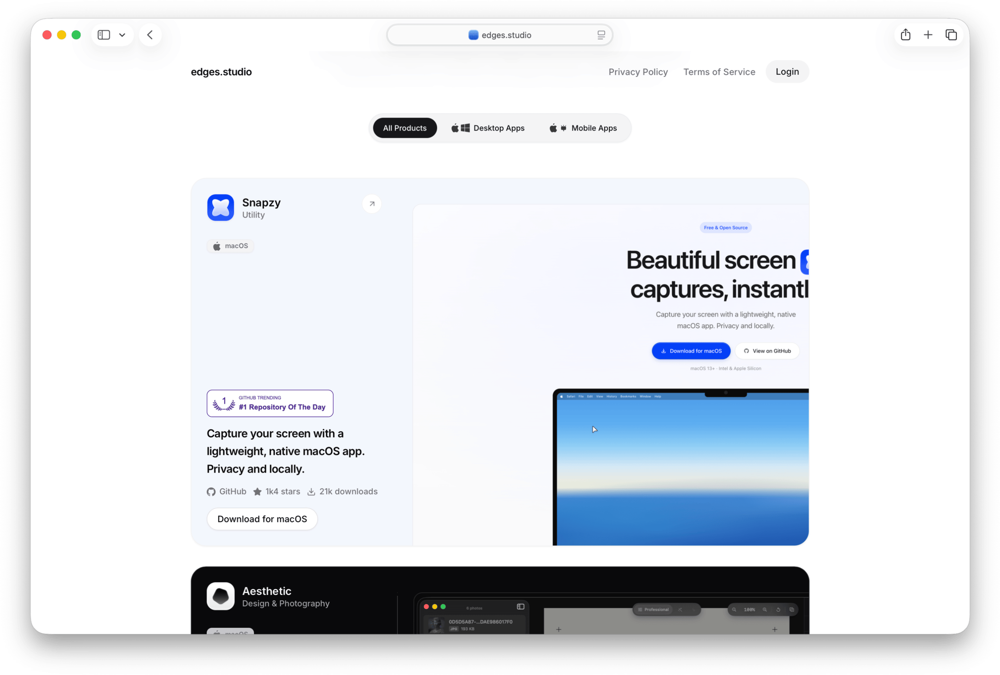

<div align="center">
  

  <h1>edges.studio</h1>
  <p><strong>Build Once. Ship Beautifully.</strong></p>

  <p>A studio for crafting premium apps, with tools you can shape around your workflow and creativity.</p>

  <p>
    Built with <a href="https://react.dev/">React 19</a>,
    <a href="https://tanstack.com/start">TanStack Start</a>,
    <a href="https://tailwindcss.com/">Tailwind CSS v4</a>, and
    <a href="https://workers.cloudflare.com/">Cloudflare Workers</a>.
  </p>

  <p>
    <a href="#development">Development</a> •
    <a href="#architecture">Architecture</a>
  </p>
</div>

## Development

### Getting Started

Ensure you have [pnpm](https://pnpm.io/) installed, then run:

```bash
# Install dependencies
pnpm install

# Start development server
pnpm dev
```

### Build & Deploy

```bash
# Build for production
pnpm build

# Deploy to Cloudflare Workers
pnpm deploy
```

### Testing & Formatting

```bash
# Run tests (Vitest)
pnpm test

# Format and lint code (Prettier & ESLint)
pnpm format

# Type check and lint check
pnpm check
```

## Architecture

This project follows a pragmatic **Feature-Sliced Design (FSD)** architecture. For details on directories, routing, and layer boundaries, see [STRUCTURE.md](./docs/STRUCTURE.md).
